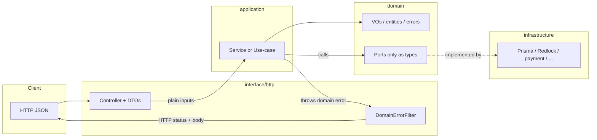
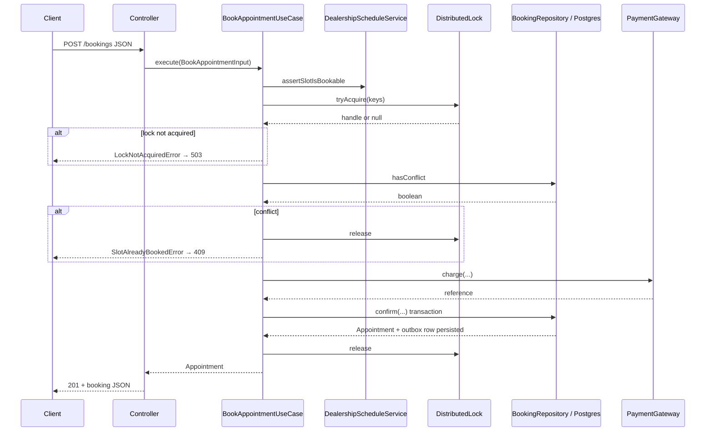

# Data flow — booking-service

How information moves from the client through NestJS layers to Postgres, Redis (locks), payment, and the outbox. For the big-picture diagram, see [../diagram/architecture-final.mmd](../diagram/architecture-final.mmd).

## 1. Typical HTTP vertical slice

Every mutating or reading API follows the same dependency direction:

- **Controller** parses the body/query, builds value objects (`SlotWindow.fromStartEnd`, `CustomerId.from`, …), and calls **one** application method.
- **Application** uses **ports** only; it never imports Prisma or Redis clients.
- **Infrastructure** satisfies those ports and maps DB rows to domain entities before returning.

## 2. Confirm booking (`POST /bookings`) — implemented path

This is the hot write path: one instance must not double-book the same bay or technician for an overlapping slot.

| Step | Where | What moves |
| --- | --- | --- |
| 1 | `BookingsController` | JSON body → `BookAppointmentDto` → validated slot + IDs → `BookAppointmentUseCase.execute(input)`. |
| 2 | `DealershipScheduleService` (application) | Asserts the slot is allowed (working hours / holidays / dealership rules) using scheduling data from repositories — **before** locking. |
| 3 | `DistributedLock` → Redlock adapter | Lock keys `lock:bay:{bayId}:{slotStart}` and `lock:tech:{technicianId}:{slotStart}` acquired on the **Redlock** Redis cluster (quorum), not the cache Redis. |
| 4 | `BookingRepository.hasConflict` → Postgres | Read: overlap query for active appointments on that bay **or** technician in the requested window. |
| 5 | `PaymentGateway.charge` | Authorisation/charge with caller `idempotencyKey` so retries do not double-charge. |
| 6 | `BookingRepository.confirm` → Postgres | **Single transaction**: overlap check again → `INSERT appointment` → `INSERT outbox` → commit. Returns domain `Appointment`. |
| 7 | `finally` on use-case | `DistributedLock.release` (token-checked release on all Redlock nodes). Failure is logged; TTL still clears stuck locks. |
| 8 | Controller | Domain `Appointment` → `BookingResponse` JSON (`201`). |

**Why two conflict checks?** `hasConflict` is the application-level re-check under the lock. `confirm` runs another overlap check inside the **same transaction** as the insert so another transaction cannot slip in between.

## 3. Read-heavy availability (cache-aside) — architectural path

The scenario and [architecture-final.mmd](../diagram/architecture-final.mmd) describe a **cache-aside** path for availability reads:

1. `GET` projected keys from **cache Redis** (`avail:bay:…`, `avail:tech:…`).
2. On miss, **SELECT** from Postgres, compute availability, `SET` with TTL.
3. On successful booking, **invalidate** the affected keys (this service does not treat Redis as source of truth).

Until a dedicated availability endpoint and `AvailabilityCache` port are wired end-to-end, treat this as the **target** read path; the confirm flow above already assumes Postgres is authoritative inside the lock.

## 4. After commit: events leave the database

This service does **not** publish to Kafka from the request thread.

| Step | Component | What happens |
| --- | --- | --- |
| A | Postgres | Transaction commits `appointment` + `outbox` row. |
| B | CDC relay (out of repo) | Tails WAL / reads unpublished outbox rows. |
| C | Kafka | Publishes `appointment.confirmed` (at-least-once). |
| D | Downstream consumers | Notifications, billing, etc. — idempotent. |

Payload for the event is built in the repository layer as part of the outbox insert (see `PrismaBookingRepository.confirm`).

## 5. Simple CRUD flows (users, bays, …)

For `GET`/`POST`/`PATCH`/`DELETE` on reference aggregates, data flow is shorter: **Controller → aggregate `*Service` → repository port → Prisma** → mapper → domain entity → controller maps to response DTO. No Redlock, no outbox unless the operation is defined to emit one.
